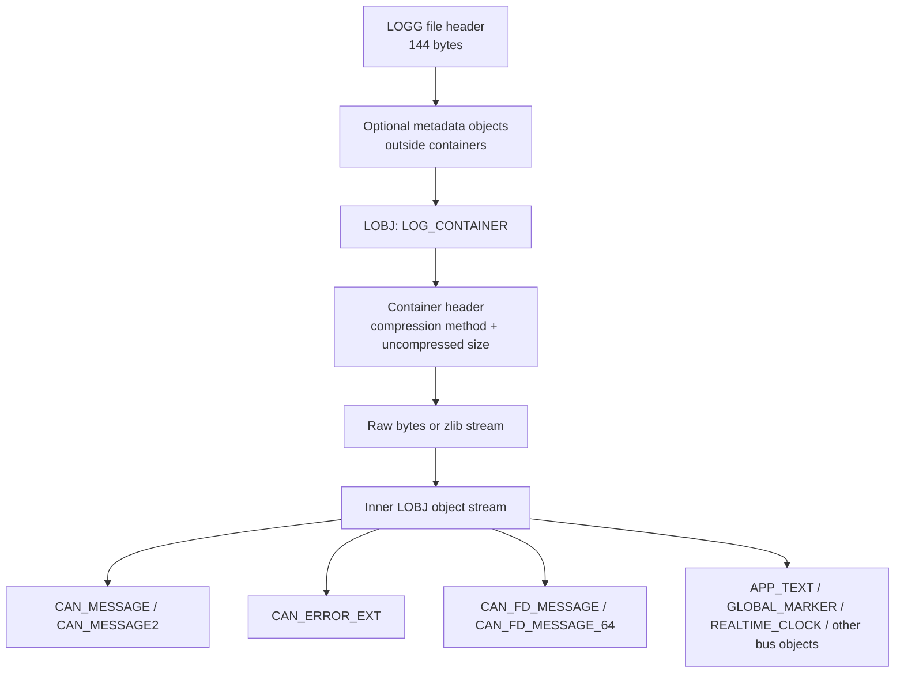

# Vector BLF CAN Trace Format

`.blf` is a proprietary binary logging format associated with Vector Informatik tools such as CANoe and CANalyzer. There is no openly published vendor specification; the highest-value primary material publicly available is Vector's binlog API surface and support knowledge-base material, plus header files attributed to Vector mirrored on public code hosting. Around that core, the format has been reverse-engineered well enough that several mature readers exist: a fairly complete GPL C++ implementation (`vector_blf`), a clean-room Rust implementation (`ablf`), readers in `python-can`, Wireshark, SavvyCAN, BUSMASTER, and historical `cantools`/`libcanblf` work.

For CAN/CAN FD ingestion, the essential parts are well understood: the 144-byte `LOGG` file header; a sequence of outer `LOBJ` objects; `LOG_CONTAINER` objects that wrap the real event stream, optionally zlib-compressed; object headers in version 1 and version 2 forms; classic CAN message records; `CAN_MESSAGE2`; `CAN_ERROR_EXT`; `CAN_FD_MESSAGE`; `CAN_FD_MESSAGE_64`; and metadata objects such as `APP_TEXT`, `GLOBAL_MARKER`, and `REALTIME_CLOCK`. Public readers agree that BLF is little-endian, that object timestamps are relative to the file's measurement start and use either 10 µs or 1 ns units, and that container boundaries may split logical objects.

The state of reverse engineering is strong for CAN and CAN FD, moderate for file-level metadata and uncommon object types, and weaker for a few details that matter for exact round-tripping. The biggest unresolved areas are the exact semantics of some file-header fields, restore-point machinery, rare object types, object-header type 3, per-object padding rules outside the common cases, and timezone semantics for start/stop wall-clock timestamps.

## Source materials

Three layers of public sources exist.

**Vector materials.** A support article showing how to use `binlog.dll` from C# or Python; the knowledge-base description of BLF as Vector's message-based binary logging format; product documentation stating that Vector tools log and replay BLF and ASCII traces. These establish that BLF is real, proprietary, message-oriented, and supported by an API, but do not provide a fully open binary specification.

**Mirrored Vector header files.** `binlog.h` exposes functions such as `BLCreateFile`, `BLReadObjectSecure`, `BLWriteObject`, `BLSeekTime`, `BLGetFileStatisticsEx`, `BLSetMeasurementStartTime`, and `BLSetWriteOptions`. `binlog_objects.h` defines object type IDs, header layouts, timestamp flags, CAN/CAN FD structures, metadata objects, compression constants, and file-statistics structures. These are the closest publicly inspectable thing to a primary binary-layout source, but they are mirrors rather than first-party publications.

**Open-source implementations.** GPL C++ `vector_blf` claims compatibility with binlog API 7.1.0; Wireshark has a broad BLF reader/writer; `python-can` provides a CAN/CAN-FD-only reader/writer; `ablf` provides a permissively licensed clean-room Rust implementation; `lblf` documents pragmatic parsing assumptions; SavvyCAN, BUSMASTER, and older `cantools` provide narrower references. `ablf` explicitly positions itself as a clean-room implementation based on public header information.

## Binary structure

A BLF file begins with a 144-byte `LOGG` file header, followed by a sequence of outer `LOBJ` objects. The real event stream is usually carried inside one or more `LOG_CONTAINER` objects. Container payloads may be uncompressed or zlib-compressed. The decompressed stream can contain logical objects that cross container boundaries, and one or more metadata objects may appear before the first `LOG_CONTAINER`.



### Core file and header structures

| Structure | Byte size | Fields | Notes |
|---|---:|---|---|
| File header (`LOGG`) | 144 total; 72 explicitly parsed by python-can, then padded to 144 | magic, header length, app/version bytes, file size, uncompressed size, object count, objects read, start `SYSTEMTIME`, stop `SYSTEMTIME` | Wireshark models some bytes differently, including `api_version`, `compression_level`, and `restore_point_offset`; preserve raw bytes since semantics are not perfectly settled |
| Object header base (`LOBJ`) | 16 | signature, header size, header version, object size, object type | Little-endian |
| Object header v1 | 16 | object flags, client index, object version, object timestamp | Used for most common CAN records |
| Object header v2 | 24 | object flags, timestamp status, object version, object timestamp, original timestamp | Adds original timestamp and status bits; type 3 is defined by Wireshark but not commonly documented elsewhere |
| Log container header | 16 | compression method, uncompressed size | `0 = none`, `2 = zlib` |
| `CAN_MESSAGE` | 16 body bytes after object header | channel, flags, DLC, ID, 8-byte data slot | Classic CAN |
| `CAN_MESSAGE2` | base CAN body plus trailer | classic CAN fields plus timing trailer | Many parsers recover payload but ignore the extra trailer |
| `CAN_ERROR_EXT` | 32 body bytes plus optional data interpretation | channel, length, flags, ECC, position, DLC, frame length, ID, ext error code, 8-byte data slot | |
| `CAN_FD_MESSAGE` | 84 body bytes | channel, flags, DLC, ID, frame length ns, arbitration bit count, FD flags, valid payload bytes, reserved, 64-byte data slot | Easier CAN FD case |
| `CAN_FD_MESSAGE_64` | 40-byte fixed body + trailing data | channel, DLC, valid bytes, txCount, ID, frame length ns, 16-bit flag set, bit timing fields, bit count, dir, extDataOffset, CRC, trailing data bytes | Padding/length handling differs from naïve `obj_size % 4` logic; common source of bugs |
| `APP_TEXT` | variable | source, reserved, text length, text | Source constants include measurement comment, DB channel info, metadata |
| `GLOBAL_MARKER` | 40 fixed bytes + variable strings | commented event type, colours, relocatable flag, group/marker/description lengths, strings | |
| `REALTIME_CLOCK` | 48 total when using v1 header + 16-byte body | absolute time in ns since Unix epoch, logging offset | |

### Object types relevant to a CAN-only decoder

The full Vector-attributed object-type list is large because BLF is multi-bus. For a CAN scope: `1 = CAN_MESSAGE`, `10 = LOG_CONTAINER`, `51 = REALTIME_CLOCK`, `65 = APP_TEXT`, `73 = CAN_ERROR_EXT`, `86 = CAN_MESSAGE2`, `92 = EVENT_COMMENT`, `96 = GLOBAL_MARKER`, `100 = CAN_FD_MESSAGE`, `101 = CAN_FD_MESSAGE_64`, `104 = CAN_FD_ERROR_64`. Unknown types should be skippable by declared size.

### Endianness, timestamps, and payload encoding

Every public implementation surveyed treats BLF as little-endian. `lblf` explicitly says its support is "only for little endian"; the binary signatures are documented in Intel byte order; the mirrored headers use Windows integer layouts; python-can's structs are all little-endian.

Timestamp handling is two-layered. At the object level, `objectFlags` determine resolution: `0x00000001` means 10 microseconds and `0x00000002` means 1 nanosecond. Public readers convert the relative object timestamp by adding the file's measurement start. At the file-header level, start and stop times are stored in `SYSTEMTIME`-like 8×16-bit tuples, giving only millisecond wall-clock precision. Header v2 objects can also carry an `original_timestamp` plus status bits indicating validity and whether the timestamp is software- or hardware-generated.

Classic CAN payload encoding is simple: the record contains a fixed 8-byte data slot, and the effective payload length is the DLC or an RTR interpretation. CAN FD comes in two materially different flavours. `CAN_FD_MESSAGE` stores a fixed 64-byte data slot plus `validDataBytes`. `CAN_FD_MESSAGE_64` stores a shorter fixed header followed by variable trailing data and extra timing/CRC fields. In both cases, raw DLC and resolved payload length should be preserved separately because downstream text formats and replay tools do not represent those concepts identically.

### Compression and containering

Compression is per-container, not whole-file. Real event bytes live in `LOG_CONTAINER` objects, and each container announces its own compression method (`0 = none`, `2 = zlib`). `lblf` documents the common case as 131,072 bytes (`0x20000`) of uncompressed data per zlib block; `python-can` uses a 128 KiB container size by default when writing. Logical objects can span container boundaries.

### Versioning and field ambiguities

Versioning exists in several places, which is part of why public readers do not agree on every header field name. The mirrored binlog API header identifies itself as BL API 4.7.1.0; `vector_blf` states compatibility with binlog API 7.1.0 and ships tests generated by older 3.9.6.0 and 4.5.2.2 Vector tools; `ablf` references a "Read Write BLF API 2018 Version 8"; object records themselves carry `headerVersion` and `objectVersion`. Raw version bytes are worth preserving.

### Illustrative hex

These synthetic snippets illustrate byte order and record boundaries; they are not bytewise reproductions of vendor files.

```text
Illustrative file-header prefix

4C 4F 47 47    ; "LOGG"
90 00 00 00    ; header length = 144
02             ; application ID (example)
00 00 00       ; app major/minor/build or adjacent version bytes (parser-dependent naming)
02 06 08 01    ; binlog/api version bytes in python-can's interpretation
...            ; file size, uncompressed size, object counts
...            ; start SYSTEMTIME (8 x u16)
...            ; stop SYSTEMTIME (8 x u16)
00 ... 00      ; padding to 144 bytes
```

```text
Illustrative classic CAN object

4C 4F 42 4A    ; "LOBJ"
20 00          ; header size = 32
01 00          ; object header version = 1
30 00 00 00    ; object size = 48
01 00 00 00    ; object type = CAN_MESSAGE

02 00 00 00    ; objectFlags = TIME_ONE_NANS
00 00          ; clientIndex
00 00          ; objectVersion
15 CD 5B 07
00 00 00 00    ; objectTimeStamp = 123456789 ns (illustrative)

01 00          ; channel = 1
00             ; flags
08             ; DLC = 8
23 01 00 00    ; ID = 0x123
11 22 33 44
55 66 77 88    ; 8-byte payload slot
```

## Reverse-engineering status

Public projects have independently converged on the same major building blocks: `LOGG`, `LOBJ`, log containers, zlib compression, classic CAN object layouts, CAN FD object families, and a set of metadata records. The strongest evidence is that multiple unrelated codebases can read real Vector-generated `.blf` files and that newer tools such as Wireshark continue to add support for more object types (CAN XL, Ethernet) while still relying on the same core structure. Reverse engineers have read and correlated public header files, generated sample BLFs with official tools, compared those files with textual exports, inferred struct layouts from code and Doxygen output, and validated against test corpora. SavvyCAN says its BLF logic was written while "peeking at" python-can and vector_blf; Wireshark documents specific quirks discovered from real-world files (metadata objects before containers; objects split across container boundaries).

### Open-source parser comparison

| Tool | Language | Licence | Completeness | CAN FD |
|---|---|---|---|---|
| python-can BLFReader/BLFWriter | Python | LGPL-3.0-only | Good for CAN/CAN FD; ignores many other object types | Yes; writes `CAN_FD_MESSAGE`, reads `CAN_FD_MESSAGE_64` |
| vector_blf | C++ | GPL-3.0-or-later | Most complete public implementation; broad object coverage, tests, Doxygen docs | Yes |
| ablf | Rust | MIT or Apache-2.0 | Focused clean-room reader; decodes containers, CAN messages, CAN error ext, AppText | Partial |
| lblf | C++ | MIT | Performance-focused; documented assumptions; narrow scope | Some CAN-focused support |
| Wireshark BLF wiretap/dissector | C | GPL-2.0-or-later | Broad multi-bus read/write | Yes |
| BUSMASTER BLF converter/library | C++ | GPL-3.0 / LGPL-3.0 components | Historic converter and library | Historically weak/bug-prone |
| SavvyCAN BLF handler | C++/Qt | MIT | Application-level loader/saver | Some support |
| aheit/cantools `libcanblf` | C | GPL-3.0 | Historical CAN-only BLF support | No |

## Known edge cases and seams

Public bug history points to a specific set of pitfalls.

- **Padding** is not uniform across all object types; `CAN_FD_MESSAGE_64` in particular has padding/length behaviour that diverges from a naïve `obj_size % 4` rule.
- **Logical objects spanning containers.** Cross-container tail handling is fundamental, not a corner case.
- **Metadata objects outside containers** appear before the first `LOG_CONTAINER` in real files.
- **Channel numbering.** Public readers often convert BLF's 1-based channels to 0-based API values; behaviour varies.
- **Timestamp resolution.** Both 10 µs and 1 ns flags occur; mixing resolutions within one file is possible.
- **Timezone semantics** of wall-clock start/stop times are demonstrably inconsistent across downstream tools.
- **Non-standard object types** (e.g. type `128`) have caused python-can bugs.
- **Append mode** has produced known issues in `python-can`.
- **Newer/Vector-generated files** can carry object types not yet in older readers.
- **Malformed BLFs** have triggered memory-safety issues in other software (notably Wireshark).

The exact semantics and naming of several file-header bytes differ across public readers. The role of `restore_point_offset` and restore-point containers is not well documented outside comprehensive libraries. Wireshark defines header type `3` but CAN-focused readers generally only implement types `1` and `2`. The long tail of non-CAN object types is only partially relevant to a CAN-first decoder.

## Available test sources

`vector_blf` includes BLFs converted from ASC using the original Windows converter (`events_from_converter/*.blf`, binlog API 3.9.6.0), BLFs generated with the original binlog library (`events_from_binlog/*.blf`, 4.5.2.2), and customer files. `ablf` reuses some of those Technica test files. MathWorks publishes a worked BLF example using `Logging_BLF.blf` and `PowerTrain_BLF.dbc` generated from a Vector CANoe sample configuration. Vector's official binlog library can be driven from Python via `ctypes` for differential testing on Windows.

A representative validation set: a small classic-CAN-only file with one container; a file with multiple containers; a file where one logical object spans containers; one file each for object types `1`, `86`, `73`, `100`, and `101`; a BLF containing metadata before the first `LOG_CONTAINER`; traces whose header timestamps fall on a millisecond boundary and on a non-boundary; files with both 10 µs and 1 ns object flags; a directory of malformed samples for strict-mode failure tests.
