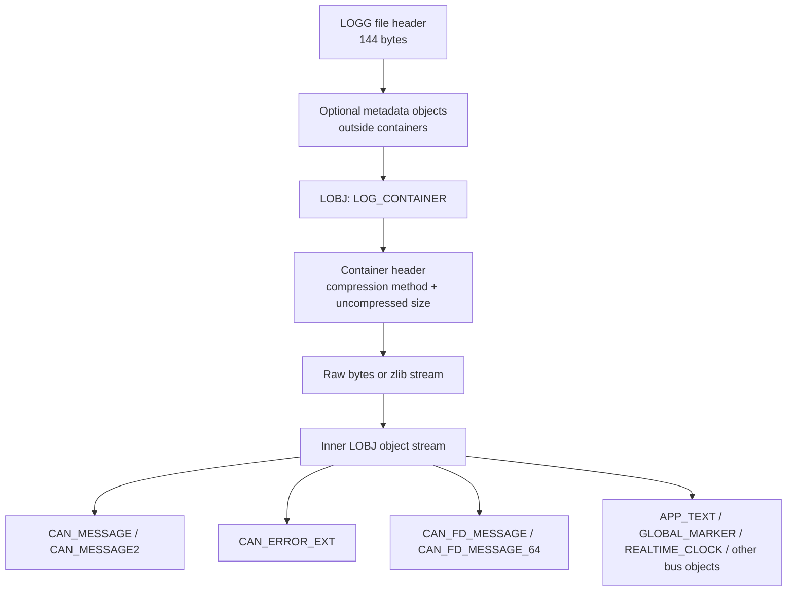
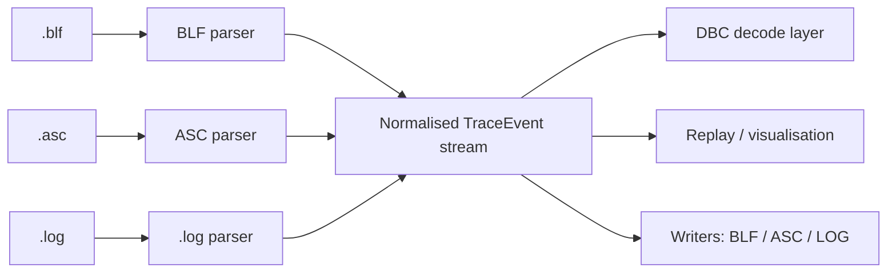

# BLF CAN trace format research for a Zig/WASM decoder

## Executive summary

The `.blf` format is a proprietary binary logging format associated with entity["organization","Vector Informatik","german automotive sw"] tools such as CANoe and CANalyzer. Public, vendor-authored binary layout documentation is not openly and cleanly published as a conventional specification; instead, the highest-value primary material available in public is Vector’s binlog API surface and support knowledge-base material, plus header files attributed to Vector that have been mirrored publicly. Around that core, the format has been reverse-engineered successfully enough that there are now several mature readers, a fairly complete GPL C++ implementation, a clean-room Rust implementation, and active downstream parsers in Python and Wireshark. The practical result is that a Zig/WASM decoder is very feasible, but you should treat BLF as a format reconstructed from overlapping sources rather than from one canonical open spec. citeturn25search0turn25search1turn7view0turn8view0turn35view2turn13view0turn20view0

For a CAN-focused implementation, the essential parts are now understood with high confidence: the 144-byte `LOGG` file header; a sequence of outer `LOBJ` objects; `LOG_CONTAINER` objects that wrap the real event stream, optionally zlib-compressed; object headers in version 1 and version 2 forms; classic CAN message records; `CAN_MESSAGE2`; `CAN_ERROR_EXT`; `CAN_FD_MESSAGE`; `CAN_FD_MESSAGE_64`; and a small but important set of metadata objects such as `APP_TEXT`, `GLOBAL_MARKER`, and `REALTIME_CLOCK`. Public readers agree that BLF is little-endian, that object timestamps are relative to the file’s measurement start and use either 10 µs or 1 ns units, and that container boundaries may split logical objects, which is the single most important architectural constraint for a streaming parser. citeturn13view0turn15view0turn16view0turn20view0turn20view1turn21view0turn35view3

The current state of reverse engineering is strong for CAN and CAN FD, moderate for file-level metadata and uncommon object types, and weaker for a few details that matter for exact round-tripping. The biggest unresolved areas are the exact semantics of some file-header fields, restore-point machinery, rare object types, object-header type 3, per-object padding rules outside the common cases, and timezone semantics for start/stop wall-clock timestamps. Open-source issue trackers show that these ambiguities still surface in practice as bugs involving padding, container splitting, unusual object types, timestamp conversion, append mode, and files produced by non-Vector or newer tools. citeturn20view0turn20view1turn24search0turn31search0turn31search7turn31search18turn38search5turn38search6turn31search35

For your use case, the best implementation strategy is a permissively licensed, clean-room Zig decoder that uses the public format facts, not copied GPL code. Concretely: implement a strict streaming parser for `LOGG` + outer `LOBJ` + `LOG_CONTAINER`, support classic CAN and both CAN FD object families, preserve unknown objects and raw fields, expose timestamps as integer nanoseconds rather than floats across the WASM boundary, and normalise BLF/ASC/.log into a shared internal event model before DBC decoding. That gives you one decoding pipeline and confines format-specific logic to thin adapters. citeturn35view2turn35view0turn27view0turn28view0turn13view0turn21view0

## Source landscape and evidentiary weight

The most reliable public sources fall into three layers. First are official or near-official Vector materials: the support article showing how to use `binlog.dll` from C# or Python, the general knowledge-base description of BLF as Vector’s message-based binary logging format, and product documentation stating that Vector tools log and replay BLF and ASCII traces. Those sources establish that BLF is real, proprietary, message-oriented, and supported by an API, but they do not by themselves give a fully open binary specification. citeturn25search0turn25search1turn25search19turn25search8

Second are public header files and API declarations attributed to Vector and mirrored on public code hosting. The mirrored `binlog.h` exposes functions such as `BLCreateFile`, `BLReadObjectSecure`, `BLWriteObject`, `BLSeekTime`, `BLGetFileStatisticsEx`, `BLSetMeasurementStartTime`, and `BLSetWriteOptions`; the mirrored `binlog_objects.h` defines object type IDs, header layouts, timestamp flags, CAN/CAN FD structures, metadata objects, compression constants, and file-statistics structures. These headers are the closest thing to a primary binary-layout source that is publicly inspectable, but because they are mirrors rather than a first-party publication channel, they should be treated as highly informative rather than as a formally published open specification. citeturn7view0turn8view0turn9view0

Third are open-source implementations and downstream consumers. The GPL C++ `vector_blf` project is the most comprehensive public implementation and states compatibility with binlog API version 7.1.0; Wireshark has a broad BLF reader/writer and explicit comments about metadata objects and object splitting across containers; python-can provides a practical CAN/CAN-FD-only reader/writer; `ablf` provides a permissively licensed clean-room Rust implementation; `lblf` documents pragmatic parsing assumptions and performance trade-offs; SavvyCAN and BUSMASTER show narrower application-level uses; and older `cantools` code adds historical context, including its early CAN-only BLF support. citeturn39search0turn13view2turn35view0turn35view2turn35view3turn13view3turn37search1turn35view5turn34search13

The practical lesson is straightforward: if you want a legally clean Zig/WASM implementation, use official Vector facts where available, supplement them with public factual descriptions from Wireshark and python-can, and treat GPL codebases as behavioural references for tests and for understanding quirks, not as text to port. The existence of `ablf` is especially helpful because it explicitly positions itself as a clean-room implementation based on public header information rather than copied GPL logic. citeturn35view2turn35view0turn35view1turn13view2

## Binary structure and field layout

The strongest cross-source consensus is that a BLF file begins with a 144-byte `LOGG` file header, followed by a sequence of outer `LOBJ` objects. The real event stream is usually carried inside one or more `LOG_CONTAINER` objects. Container payloads may be uncompressed or zlib-compressed, and the decompressed stream can contain logical objects that cross container boundaries. Wireshark additionally notes that one or more metadata objects may appear before the first `LOG_CONTAINER`. citeturn13view0turn20view0turn19view4turn35view3



### Core file and header structures

The table below summarises the minimum binary structures a CAN/CAN-FD decoder needs to understand. Sizes are derived from the public struct definitions and the Python/Wireshark parsers; where the public sources disagree on semantics, that disagreement is noted. citeturn15view0turn17view1turn20view0turn20view1turn8view0turn9view0

| Structure | Byte size | Fields you need | Notes | Source |
|---|---:|---|---|---|
| File header (`LOGG`) | 144 total; 72 explicitly parsed by python-can, then padded to 144 | magic, header length, app/version bytes, file size, uncompressed size, object count, objects read, start `SYSTEMTIME`, stop `SYSTEMTIME` | Wireshark models some bytes differently, including `api_version`, `compression_level`, and `restore_point_offset`; preserve raw bytes because semantics are not perfectly settled publicly | citeturn13view0turn20view0 |
| Object header base (`LOBJ`) | 16 | signature, header size, header version, object size, object type | Little-endian | citeturn15view0turn8view0 |
| Object header v1 | 16 | object flags, client index, object version, object timestamp | Used for most common CAN records | citeturn15view0turn8view0 |
| Object header v2 | 24 | object flags, timestamp status, object version, object timestamp, original timestamp | Adds original timestamp and status bits; header type 2 is widely used, type 3 is defined by Wireshark but not commonly documented publicly | citeturn20view1turn20view0 |
| Log container header | 16 | compression method, uncompressed size | `0 = none`, `2 = zlib` | citeturn15view0turn20view0 |
| `CAN_MESSAGE` | 16 body bytes after object header | channel, flags, DLC, ID, 8-byte data slot | Classic CAN | citeturn17view1turn8view0 |
| `CAN_MESSAGE2` | base CAN body plus trailer | classic CAN fields plus timing trailer | Many parsers recover payload but ignore the extra trailer unless they need full fidelity | citeturn8view0turn21view0turn16view0 |
| `CAN_ERROR_EXT` | 32 body bytes plus optional data interpretation | channel, length, flags, ECC, position, DLC, frame length, ID, ext error code, 8-byte data slot | Important if you want parity with Vector trace views | citeturn15view3turn21view0turn9view0 |
| `CAN_FD_MESSAGE` | 84 body bytes | channel, flags, DLC, ID, frame length ns, arbitration bit count, FD flags, valid payload bytes, reserved, 64-byte data slot | Easier CAN FD case | citeturn17view1turn20view2turn18view0 |
| `CAN_FD_MESSAGE_64` | 40-byte fixed body + trailing data | channel, DLC, valid bytes, txCount, ID, frame length ns, 16-bit flag set, bit timing fields, bit count, dir, extDataOffset, CRC, trailing data bytes | Padding/length handling differs from naïve `obj_size % 4` logic; common source of bugs | citeturn21view0turn16view3turn38search6 |
| `APP_TEXT` | variable | source, reserved, text length, text | Includes metadata-style text records; source constants include measurement comment, DB channel info, metadata | citeturn9view0 |
| `GLOBAL_MARKER` | 40 fixed bytes + variable strings | commented event type, colours, relocatable flag, group/marker/description lengths, strings | Useful if you want parity with comments/markers | citeturn14view4turn9view0 |
| `REALTIME_CLOCK` | 48 total object size when using v1 header + 16-byte body | absolute time in ns since Unix epoch, logging offset | Helpful for absolute-time reconstruction | citeturn9view0 |

### Object types most relevant to a CAN-only decoder

The public object-type list attributed to Vector is very large because BLF is multi-bus. For your scope, the types that matter most are `1 = CAN_MESSAGE`, `10 = LOG_CONTAINER`, `51 = REALTIME_CLOCK`, `65 = APP_TEXT`, `73 = CAN_ERROR_EXT`, `86 = CAN_MESSAGE2`, `92 = EVENT_COMMENT`, `96 = GLOBAL_MARKER`, `100 = CAN_FD_MESSAGE`, `101 = CAN_FD_MESSAGE_64`, and `104 = CAN_FD_ERROR_64`. A robust CAN decoder should also be able to skip any unknown type by declared size without failing the whole parse. citeturn8view0turn14view4

### Endianness, timestamps, and payload encoding

Every public implementation surveyed treats BLF as little-endian. `lblf` explicitly says its own support is “only for little endian”, the binary signatures are documented in Intel byte order, the mirrored headers use Windows integer layouts, and python-can’s structs are all little-endian. citeturn35view3turn15view0turn20view0

Timestamp handling is two-layered. At the object level, `objectFlags` determine resolution: `0x00000001` means 10 microseconds and `0x00000002` means 1 nanosecond, and public readers convert the relative object timestamp by adding the file’s measurement start. At the file-header level, start and stop times are stored in `SYSTEMTIME`-like 8×16-bit tuples, which gives only millisecond wall-clock precision. Header v2 objects can also carry an `original_timestamp` plus status bits indicating validity and whether the timestamp is software- or hardware-generated. citeturn8view0turn15view2turn15view4turn20view1turn16view0

Classic CAN payload encoding is simple: the record contains a fixed 8-byte data slot, and the effective payload length is the DLC or an RTR interpretation. CAN FD comes in two materially different flavours. `CAN_FD_MESSAGE` stores a fixed 64-byte data slot plus `validDataBytes`; `CAN_FD_MESSAGE_64` stores a shorter fixed header followed by variable trailing data and extra timing/CRC fields. In both cases you should preserve both raw DLC and resolved payload length, because downstream text formats and replay tools do not represent those two concepts identically. citeturn20view2turn21view0turn18view0turn22search0

### Compression and containering

Compression is not a whole-file property in the way many file formats use it. BLF stores real event bytes in `LOG_CONTAINER` objects, and each container announces its own compression method. Public readers agree on method `0 = none` and `2 = zlib`. `lblf` documents the common case as 131,072 bytes (`0x20000`) of uncompressed data per zlib block, and python-can uses a 128 KiB container size by default when writing. This is exactly why a BLF decoder should be stream-first rather than file-buffer-first. citeturn20view0turn15view0turn35view3turn18view0

### Versioning and field ambiguities

Versioning exists in several places, and that is part of why public readers do not agree on every header field name. The mirrored binlog API header identifies itself as BL API 4.7.1.0; the `vector_blf` project states compatibility with binlog API 7.1.0 and ships tests generated by older 3.9.6.0 and 4.5.2.2 Vector tools; `ablf` references a “Read Write BLF API 2018 Version 8”; and object records themselves carry `headerVersion` and `objectVersion`. A good decoder must therefore preserve raw version bytes and avoid over-interpreting fields that are not required for CAN payload recovery. citeturn7view0turn39search0turn35view2

### Illustrative hex

The following snippets are synthetic examples built from the public field layouts, intended to illustrate byte order and record boundaries rather than to reproduce a vendor file verbatim. The signatures, field order, and little-endian layout are consistent with the public sources. citeturn15view0turn17view1turn20view0turn21view0

```text
Illustrative file-header prefix

4C 4F 47 47    ; "LOGG"
90 00 00 00    ; header length = 144
02             ; application ID (example)
00 00 00       ; app major/minor/build or adjacent version bytes (parser-dependent naming)
02 06 08 01    ; binlog/api version bytes in python-can's interpretation
...            ; file size, uncompressed size, object counts
...            ; start SYSTEMTIME (8 x u16)
...            ; stop SYSTEMTIME (8 x u16)
00 ... 00      ; padding to 144 bytes
```

```text
Illustrative classic CAN object

4C 4F 42 4A    ; "LOBJ"
20 00          ; header size = 32
01 00          ; object header version = 1
30 00 00 00    ; object size = 48
01 00 00 00    ; object type = CAN_MESSAGE

02 00 00 00    ; objectFlags = TIME_ONE_NANS
00 00          ; clientIndex
00 00          ; objectVersion
15 CD 5B 07
00 00 00 00    ; objectTimeStamp = 123456789 ns (illustrative)

01 00          ; channel = 1
00             ; flags
08             ; DLC = 8
23 01 00 00    ; ID = 0x123
11 22 33 44
55 66 77 88    ; 8-byte payload slot
```

## Reverse-engineering status and open-source toolchain

The state of reverse engineering is good enough that the format should be considered operationally understood for CAN/CAN FD ingestion, but not fully “closed” in the archival or scholarly sense. Public projects have independently converged on the same major building blocks: `LOGG`, `LOBJ`, log containers, zlib compression, classic CAN object layouts, CAN FD object families, and a set of metadata records. The strongest evidence of successful reverse engineering is not a blog post; it is the fact that multiple unrelated codebases can read real Vector-generated `.blf` files and that newer tools such as Wireshark continue to add support for more object types, including CAN XL and Ethernet families, while still relying on the same core structure. citeturn13view2turn35view0turn35view1turn35view2turn35view3

The main techniques used by successful reverse engineers are also clear from the sources. They read and correlate public header files attributed to Vector, inspect or generate sample BLFs with official tools, compare those files with textual exports, infer struct layouts from code and Doxygen output, and then validate against large corpora of test logs. `ablf` explicitly describes itself as a clean-room implementation based on a public “Read Write BLF API” header, SavvyCAN says its BLF logic was written while “peeking at” python-can and vector_blf, and Wireshark documents specific quirks discovered from real-world files, such as metadata objects before containers and objects split across container boundaries. citeturn35view2turn13view3turn13view2

### Open-source parser and tool comparison

| Tool | Language | Licence | Practical completeness | CAN FD support | Maintenance status | Source |
|---|---|---|---|---|---|---|
| python-can BLFReader/BLFWriter | Python | LGPL-3.0-only | Good for CAN/CAN FD logging and replay; intentionally limited to CAN/CAN FD and ignores many other BLF object types | Yes, including write support for `CAN_FD_MESSAGE`; reads `CAN_FD_MESSAGE_64` | Active: public issues and releases in 2025–2026 | citeturn35view0turn13view0turn18view0turn31search22turn31search13 |
| vector_blf | C++ | GPL-3.0-or-later | Most complete public implementation; broad object coverage, tests, Doxygen docs, packaging | Yes | Maintained enough to show late-2025 repository activity and many tags/commits | citeturn35view1turn34search2turn39search0turn34search6 |
| ablf | Rust | MIT or Apache-2.0 | Focused clean-room reader; decodes containers, CAN messages, CAN error ext, AppText; narrower than vector_blf | Partial | Small project, but valuable because permissive and explicitly clean-room | citeturn35view2 |
| lblf | C++ | MIT | Performance-focused reader with documented assumptions; narrower scope | Some CAN-focused support; not a full general BLF stack | Niche; public status appears lightweight | citeturn35view3 |
| Wireshark BLF wiretap/dissector | C | GPL-2.0-or-later (Wireshark project licence model) | Broad multi-bus read/write support; useful as robustness reference rather than as embedding candidate | Yes | Active: fixes and security issues continue into 2025–2026 | citeturn13view2turn31search33turn31search35 |
| BUSMASTER BLF converter/library | C++ | GPL-3.0 / LGPL-3.0 components visible in repo | Historic converter and library; useful for archaeology, but not a modern full-fidelity reference | Historically weak/bug-prone for newer cases | Mature but old; BLF converter dates back to 2014 and issues persisted later | citeturn37search1turn37search10turn31search34turn31search11turn31search32 |
| SavvyCAN BLF handler | C++/Qt | MIT | Application-level loader/saver; useful for workflow and behavioural comparisons, not a complete spec | Some support, but BLF implementation is not positioned as canonical | Active application project | citeturn36view1turn13view3 |
| aheit/cantools `libcanblf` | C | GPL-3.0 | Historical parser/converter library; explicitly began as CAN-only BLF support | No CAN FD in initial BLF support | Legacy value mainly | citeturn35view5turn34search13 |

### What these projects have solved

The hard parts they have collectively solved are the ones you care about most: identifying record boundaries, decompressing containers, reconstructing broken-at-boundary objects, decoding classic CAN and CAN FD messages, skipping unsupported object types safely, and generating interoperable logs at least for the common CAN cases. The fact that MathWorks can read Vector-generated BLFs, that python-can can write BLFs compatible with Vector tools, and that vector_blf ships tests generated from original Vector converters and binlog libraries are all practical signs that the reverse-engineered understanding is real rather than speculative. citeturn27view0turn18view0turn39search0

### Where reverse engineering still shows seams

The seams show up in edge cases. python-can has had documented bugs around padding, non-standard object types such as type `128`, append behaviour, timestamp interpretation, and timezone rendering. Wireshark has had both correctness fixes and at least one security issue in BLF handling. BUSMASTER’s converter historically produced mismatches when converting BLF to `.log`. These are not reasons to avoid implementing BLF; they are reasons to harden your parser and to design it around lossless raw-field preservation. citeturn38search5turn38search6turn31search18turn31search0turn31search7turn31search35turn31search25turn31search11turn31search32

## Legal and IP considerations

BLF is proprietary, but that does not make independent interoperability work impossible. In the EU, Directive 2009/24/EC expressly permits decompilation and related acts when necessary to achieve interoperability of an independently created program, subject to conditions, and it nullifies contrary contractual provisions for that specific interoperability exception. In the US, 17 U.S.C. §1201(f) creates an interoperability-oriented anti-circumvention exception, and the classic `Sega v. Accolade` line of authority is still the standard case law cited in software reverse-engineering discussions. More broadly, the Supreme Court’s `Google v. Oracle` decision reinforced the legal importance of interoperability and API reimplementation, even though it did not decide every copyrightability question about APIs in the abstract. This is not legal advice, but the doctrinal backdrop is substantially more favourable to clean-room interoperability work than to wholesale code copying. citeturn33search0turn33search3turn32search1turn33search1turn33search8

For your implementation, the most important IP point is licensing hygiene. `vector_blf`, Wireshark, BUSMASTER, and `aheit/cantools` impose GPL-family obligations. If your Zig/WASM decoder is intended to remain permissively licensed or easy to embed in proprietary applications, do not port or transliterate their code. By contrast, `ablf` is permissively licensed and expressly describes itself as a clean-room implementation based on public header information, which makes it a much safer reference point if you need a public codebase to compare behaviour against. citeturn34search2turn37search1turn35view5turn35view2

A second IP point concerns test data. `ablf` notes that some of its test files come from `vector_blf` and are GPL-licensed as test/input data. That may be workable for internal validation but is not automatically suitable for redistribution inside your own project or npm/crate-style artifacts. Prefer either your own generated files, vendor sample files whose redistribution terms are clear, or public test corpora whose licensing you have reviewed carefully. citeturn35view2turn39search0

Finally, if you have access to Vector tooling, the official binlog library is strategically valuable for differential testing even if you never ship it. Vector’s own support article shows `binlog.dll` being called from Python via `ctypes`, which gives you a high-confidence oracle for file generation and read-back behaviour on Windows. That is useful both technically and legally because it lets you validate a clean-room Zig decoder against official outcomes without copying official implementation text. citeturn25search0turn7view0

## Decoder design for Zig/WASM

The right abstraction is not “a BLF reader” but “a streaming source of normalised trace events”. BLF, ASC, and SocketCAN-style `.log` should all feed the same internal event model; the DBC layer should sit above that model rather than inside each format reader. This architecture is supported by the realities of the formats themselves: BLF is containerised and object-rich, ASC is textual and typically CANoe-oriented, and `.log` is usually more line-oriented and lossy. A neutral event model lets you keep BLF-specific metadata when it exists, while degrading gracefully on formats that never carried it. citeturn27view0turn28view0turn35view0

A good internal model for your use case would preserve at least these fields: raw timestamp in integer nanoseconds; wall-clock start/stop metadata when present; channel number; bus type; arbitration ID plus raw ID flags; frame kind (`data`, `remote`, `error`, `marker`, `comment`, `metadata`); classical DLC nibble and resolved payload length; payload bytes up to 64; CAN FD flags (`EDL/FDF`, `BRS`, `ESI`); direction; and an optional `raw_object` blob for unsupported or unparsed records. That is more information than `.asc` and `.log` natively provide, but it prevents BLF-to-text-to-BLF round-tripping from silently destroying meaning. The need to preserve raw timestamps, raw DLC, and unknown object payloads follows directly from the format’s multiplicity of object versions and from the public bugs caused by over-normalising too early. citeturn16view0turn18view0turn21view0turn31search7turn38search6

From a WASM perspective, the biggest design choice is timestamp representation. BLF commonly carries nanosecond-resolution object timestamps, while JavaScript `Number` cannot safely represent all large integer nanosecond values. Expose timestamps either as relative `u64` nanoseconds carried through WASM/JS as `BigInt`, or as split high/low 64-bit parts, or as `{seconds, nanos}` tuples. Reserve floating-point seconds only for convenience adapters. That keeps your decoded traces stable across long captures and avoids the class of rounding bugs already seen in public tooling. citeturn15view2turn15view4turn31search7turn31search0

For the streaming core, implement three layers. The file layer reads the 144-byte `LOGG` header and outer `LOBJ` objects. The container layer handles `LOG_CONTAINER`, zlib inflate, and a `tail` buffer that carries incomplete logical objects across container boundaries. The event layer parses inner `LOBJ` records into normalised events. This is close to the design used by successful public parsers because the container boundary problem is fundamental to the format, not a stylistic choice. citeturn13view0turn16view4turn19view4turn35view3

Your public API should probably have two surfaces. One is a pull iterator for native Zig use, along the lines of `nextEvent() !?TraceEvent`. The other is an incremental push interface for browsers, such as `pushChunk([]const u8)`, `finish()`, and a callback or queue of decoded events. The push form maps naturally to streaming fetch responses, drag-and-drop partial loads, and service-worker caching. Both surfaces should share the same parser core and differ only in how bytes arrive. The justification is again format-driven: zlib containers and split objects mean parsers cannot assume full-file access, so designing for streaming from the start reduces complexity rather than adds it. citeturn35view3turn16view4turn20view0

Error handling needs at least three modes. A strict mode should fail on invalid signatures, impossible sizes, unsupported compression methods, and integer overflows. A best-effort mode should emit all recoverable events, preserve the raw offending object, and attempt signature-based resynchronisation only after a bounded amount of skipped data. A forensic mode can expose outer objects and raw container bytes for debugging. The reason to keep all three is that public BLF readers routinely encounter malformed, truncated, or tool-specific files, while malformed BLFs have also triggered memory-safety issues in other software. citeturn16view5turn38search5turn38search6turn31search35

### Interoperability with ASC and `.log`

For mapping BLF to `.asc` and `.log`, think in terms of semantic fidelity tiers rather than one universal “convert” function. BLF classic CAN and CAN FD messages map cleanly into a message-centric event model. `GLOBAL_MARKER`, `APP_TEXT`, `EVENT_COMMENT`, and `REALTIME_CLOCK` do not: they require either explicit side channels, comments, or deliberate loss reporting when exporting to text. MathWorks’ BLF example makes clear that a BLF can carry channel information and enough metadata to support database-driven decoding, while its file-format limitations page also shows that downstream consumers often only implement the CAN/CAN FD subset. In other words, the ecosystem already treats text exports as projections of BLF, not as complete equivalents of it. citeturn27view0turn28view0

A practical mapping strategy is therefore:
- define one lossless internal `TraceEvent`;
- give BLF a rich reader and a conservative writer;
- give ASC a reader/writer that preserves comments and markers where possible;
- give `.log` a minimalist reader/writer that focuses on frames, timestamps, and interface/channel labels; and
- when exporting from BLF to a poorer format, attach a loss report recording which object types and fields were dropped. citeturn35view0turn27view0turn28view0

### Edge cases you should plan for

The public bug history points to a specific checklist. Handle metadata outside containers. Handle objects split across containers. Do not assume padding is uniform across all object types. Treat channel numbering carefully because public readers often convert BLF’s 1-based channels to 0-based API values. Support both 10 µs and 1 ns timestamps. Preserve raw header bytes because file-header semantics differ across public readers. Be conservative around timezone conversion of wall-clock start/stop times. And never assume that a “CAN FD file” uses only object type `100`; Vector and downstream tools also use `101` with different layout and padding behaviour. citeturn13view2turn16view0turn38search6turn35view0turn31search0turn31search7



## Test vectors, validation, and implementation plan

The best public sample sources are already visible in the ecosystem. `vector_blf` says its tests include BLFs converted from ASC using the original Windows converter (`events_from_converter/*.blf`, binlog API 3.9.6.0), BLFs generated with the original binlog library (`events_from_binlog/*.blf`, 4.5.2.2), and customer files. `ablf` reuses some of those Technica test files. MathWorks publishes a worked BLF example using `Logging_BLF.blf` and `PowerTrain_BLF.dbc`, stating that the BLF was generated from a Vector CANoe sample configuration. If you have Vector access, the highest-confidence path is to generate your own fixture matrix from CANoe/CANalyzer and/or the official binlog library; if you do not, those public test sources are still enough to build a very capable decoder. citeturn39search0turn35view2turn27view0

A disciplined milestone plan would look like this. First, implement file-header parsing and outer-object iteration only, with exhaustive length checks and zero-copy slices where possible. Second, add `LOG_CONTAINER` handling with incremental zlib inflate and a cross-container tail buffer. Third, support `CAN_MESSAGE`, `CAN_MESSAGE2`, `CAN_ERROR_EXT`, `CAN_FD_MESSAGE`, and `CAN_FD_MESSAGE_64`, plus `APP_TEXT`, `GLOBAL_MARKER`, and `REALTIME_CLOCK`. Fourth, add normalisation into your shared event model and hook your existing Zig DBC decoder above it. Fifth, add best-effort recovery, unknown-object preservation, and export-to-ASC/.log projections with explicit loss reporting. Sixth, add fuzzing and differential tests against public parsers and, if available, official Vector outputs. This sequence mirrors the actual risk profile: container handling and CAN FD edge cases are more important than exhaustive support for every rare object type. citeturn18view0turn21view0turn16view4turn35view2turn35view0

The validation suite should include at least these cases:
a small classic-CAN-only file with one container; a file with multiple containers; a file where one logical object spans containers; one file each for object types `1`, `86`, `73`, `100`, and `101`; a BLF containing metadata before the first `LOG_CONTAINER`; traces whose header timestamps fall on a millisecond boundary and on a non-boundary; files with both 10 µs and 1 ns object flags; a directory of malformed samples for strict-mode failure tests; and one differential corpus round-tripped through Vector tools if possible. Public bug reports on padding, timestamp conversion, unusual object types, and append mode are exactly the kinds of regressions this suite should lock down. citeturn19view5turn16view0turn38search5turn38search6turn31search7turn31search18turn31search0

### High-confidence recommendations

The most defensible implementation choice is a clean-room Zig parser that takes its factual spec notes from the public Vector-attributed headers, Wireshark’s broad structural description, and behaviour observed from permissively licensed or self-generated test files. Store raw bytes and raw numeric fields wherever the public sources disagree. Do not model time as floating-point internally. Do not hard-code one padding rule for all objects. And do not let BLF-specific details leak up into your DBC layer. If you follow those constraints, you can ship a WASM decoder that is fast, portable, legally cleaner than a GPL port, and robust enough for real vehicle traces. citeturn8view0turn13view2turn35view2turn38search6

### Open questions and limitations

Some details remain publicly under-specified. The exact semantics and naming of several file-header bytes differ across public readers. The role of `restore_point_offset` and restore-point containers is not well documented outside comprehensive libraries. Wireshark defines a header type `3`, but public CAN-focused readers generally only implement types `1` and `2`. Timezone semantics for wall-clock timestamps are demonstrably inconsistent across downstream tools. And the long tail of non-CAN object types is only partially relevant to your project, so a CAN-first decoder should plan to skip them safely rather than claim exhaustive BLF support on day one. citeturn20view0turn20view1turn24search0turn31search0turn31search7