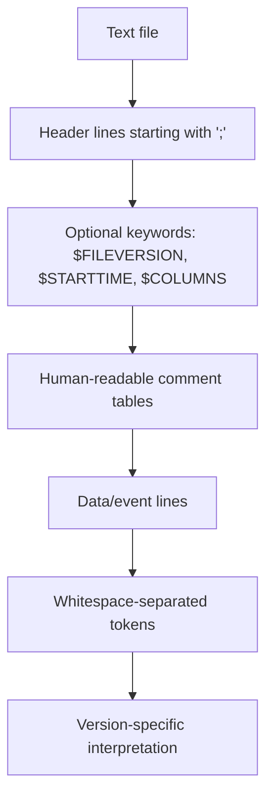

# PEAK-System TRC CAN Trace Format

PEAK-System's `.trc` is a text-based, line-oriented CAN trace format used by tools such as PCAN-View, PCAN-Trace, PCAN-Explorer, and PCAN-Basic. The file is plain text: comment lines start with `;`, columns are separated by blanks, lines are terminated with CR/LF, and there is one message or warning or error per line. There is no container endianness, no record alignment requirement, no block compression, no container checksum, and no string table. The exceptions are semantic byte-order rules inside certain encoded payloads, where warning and status codes are stored in Motorola (big-endian) order inside the text-represented data bytes.

An official PEAK CAN TRC File Format PDF specification exists publicly and covers versions 1.0, 1.1, 1.2, 1.3, 2.0, 2.1, and 3.0. The 1.x family uses fixed whitespace-separated columns; 2.x introduces a `$COLUMNS` schema; 3.0 extends that schema for CAN XL.

## Format families

| Family | Structural model | Major capabilities |
|---|---|---|
| 1.0–1.3 | Fixed positional whitespace columns | CAN, then Rx/Tx split, then bus/J1939 additions |
| 2.0–2.1 | `$COLUMNS`-driven text schema | CAN FD, typed events, status/error/counter records |
| 3.0 | Extended `$COLUMNS` schema | CAN XL plus new XL-related columns and record types |

## Versioned structure and headers

Version **1.0** has no `$FILEVERSION` keyword and uses a banner-style descriptive header; tools commonly treat "no version keyword" as 1.0 by implication, matching the official 1.0 example. Version **1.1** adds `;$FILEVERSION=1.1`, `;$STARTTIME=...`, and a `Type` column. Version **1.2** increases time-offset precision to microseconds and adds a **Bus** column. Version **1.3** adds a **Reserved** column, supports J1939, and includes a header table of configured connections/buses.

Version **2.0** is the first schema-driven generation: the header includes `;$COLUMNS=...`, column identifiers are **case-sensitive**, and the **column order cannot be changed**, although some columns are optional. The mandatory order for 2.0 is `[N],O,T,I,d,l/L,D`; for 2.1 it becomes `[N],O,T,[B],I,d,[R],l/L,D`; and for 3.0 it becomes `[N],O,T,[B],I,d,[R],[V],[S],[A],[r],[s],L,D`.

The two header keywords that matter operationally are `;$STARTTIME` and `;$COLUMNS`. For 1.1, PEAK defines `$STARTTIME` as a floating-point count of days since **30 December 1899**, with the fractional part representing a fraction of the day. PCAN-Basic Linux release notes show PEAK has had to fix `$STARTTIME` behaviour in some releases to match the spec and to use local time, so the raw header value and the relative millisecond/microsecond offset should be preserved separately; absolute time is best treated as a derived convenience field with explicit timezone policy.

## IDs, lengths, payloads, and multi-byte semantics

Across 1.x and 2.x, standard 11-bit CAN IDs are rendered as **4 hex digits**, extended 29-bit IDs as **8 hex digits**, and `FFFFFFFF` is a special marker for warning records in 1.x. In 3.0, the spec changes formatting rules for the `I` column: **3 digits** for 11-bit CAN IDs and PIDs, **8 digits** for 29-bit IDs, and `-` for several non-data event types. ID width rules differ across versions and the extended/standard distinction is inferred from version-aware width and numeric range, not from a single universal heuristic.

The length model also changes by family. In 1.x, the numeric field is a conventional DLC in the 0–8 range. In 2.x and 3.0, PEAK distinguishes actual data length `l` from DLC `L`; the spec says either `l` or `L` must be present, where `l` is the actual number of data bytes and `L` is the data length code. Version 2.0 allows actual length up to **64** bytes for CAN FD; version 2.1 extends the actual/data-length model to support J1939 records; version 3.0 allows **0–2048** data bytes in the data column, reflecting CAN XL support.

The file itself has no binary byte order, but several semantic payloads do. Version 1.x warning codes are stored in the first four data bytes in **Motorola format** (most-significant byte first). The same big-endian encoding is used for hardware status codes in 2.x and 3.0. Error warnings in 1.x may also be followed by optional symbolic short names at the end of the line; loaders typically ignore them.

## Record types and non-frame records

For 2.0 and 2.1, PEAK defines these message types in the `T` column: `DT`, `FD`, `FB`, `FE`, `BI`, `RR`, `ST`, `ER`, and `EC`; 2.1 also adds `EV` for user-defined events. `FD`, `FB`, `FE`, and `BI` correspond to CAN FD frames with different BRS/ESI states. `ST` is hardware status, `ER` is error frame, `EC` is error counter change, and `EV` is free-form user text.

Version **3.0** adds `XL`, `PE`, `OF`, and `EN` on top of the 2.1 set. The spec also introduces optional CAN XL-related columns `V`, `S`, `A`, `r`, and `s`, corresponding to **VCID**, **SDT**, **AF**, **RRS**, and a renamed/added security-related field. Error frames in 3.0 extend the position code space for XL-specific fields; protocol exceptions have **6 data bytes**; overload frames have **3**; error notifications have **5**.

Not every line in a 2.1/3.0 file is a CAN frame. `EV` is free-form text; `ST`, `EC`, `ER`, `PE`, `OF`, and `EN` carry typed payload bytes with different internal meanings. A line splitter that always expects `[ID] [dir] [len] [data...]` will fail on legal logs.

## Parser-relevant edge cases

- **Version detection.** 1.0 has no `$FILEVERSION`. 1.1/1.2/1.3 are positional. 2.0/2.1/3.0 are `$COLUMNS`-driven; absence of `$COLUMNS` in those versions should be treated as malformed.
- **Column dispatch.** For 2.x/3.0, the column-index map is built from `$COLUMNS`. Identifiers are case-sensitive, the order cannot change, but columns can be omitted per version rules.
- **Line endings.** The spec says lines are CR/LF terminated, but real files include `\n`-only variants. Liberal acceptance with line-numbered diagnostics is the standard pattern.
- **Negative relative timestamps.** Historical Linux PCAN-Basic builds have produced traces with negative relative timestamps.
- **`$STARTTIME` timezone.** The spec gives the 1899-12-30 epoch model but does not provide a clean timezone model; PEAK's Linux changelog shows historical fixes around local-time handling. Preserve raw start time and relative offsets separately.
- **Third-party emitters.** PEAK's support forum states that third-party producers must follow PEAK's rules if they want PEAK tools to accept the files; "PEAK-like" `.trc` files in the wild may need a tolerant mode.

## Cross-format properties

| Property | `.trc` | `.asc` | `.blf` |
|---|---|---|---|
| Format class | Text | Text | Binary |
| Header model | Semicolon comments + keywords (`$FILEVERSION`, `$STARTTIME`, `$COLUMNS`) | Text header with `date`, `base`, timestamp mode, trigger blocks | Binary file header `LOGG` |
| Record model | One text line per frame/event | One text line per frame/event | Binary objects inside log containers |
| Compression | None | None | Optional zlib-compressed log containers |
| Schema evolution | Strongly versioned: 1.x, 2.x, 3.0 | Tool/version variations; de facto parser behaviour | Object-type based extensibility |
| CAN FD support | Yes from 2.0 | Yes in modern variants | Yes |
| CAN XL support | Yes in 3.0 | Not established | Not established in public sources |

## Available test sources

The official PEAK spec includes example fragments for every family from 1.0 through 3.0. Real `.trc` files can be generated locally with PCAN-View, PCAN-Explorer, or PCAN-Basic. PCAN-Basic documents deterministic defaults: the trace file name defaults to the channel name such as `PCAN_USBBUS1.trc`, the default file size is **10 MB**, and the destination folder defaults to the calling process path unless explicitly overridden; the receive queue must be actively read for messages to be written as successfully sent.

`python-can`'s TRC reader recognises versions **1.1, 1.3, 2.0, and 2.1**, with TRC 1.3 support and remote-frame support added in 2025 release notes. It is not a complete TRC 3.0/CAN XL implementation. SavvyCAN issues record recurring TRC compatibility problems including all IDs being parsed as `0x00`, loss of timestamps, mishandling of extended IDs on playback, and crashes on load.

## Minimum regression corpus

- **TRC 1.0**: standard frame, extended frame, RTR, error warning, error frame.
- **TRC 1.1**: Rx/Tx distinction, `$STARTTIME`, warning, error, RTR.
- **TRC 1.3**: multi-bus header table, reserved column, J1939 line.
- **TRC 2.0**: `DT`, `FD`, `FB`, `FE`, `BI`, `RR`, `ST`, `ER`, `EC`; both `l` and `L` variants.
- **TRC 2.1**: optional `B` and `R`, `EV` event lines, J1939.
- **TRC 3.0**: `XL`, `PE`, `OF`, `EN`, and optional `V/S/A/r/s` columns.
