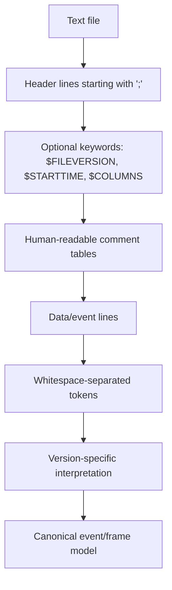
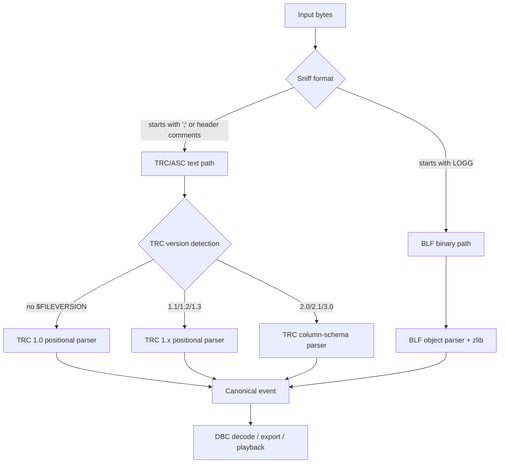

# PEAK-System TRC CAN Trace Format for Zig and WASM Decoding

## Executive summary

The central finding is straightforward: **PEAK-System’s `.trc` format is primarily a text-based, line-oriented CAN trace format**, not a binary container like `.blf`. An official public specification now exists in the form of the **PEAK CAN TRC File Format** PDF, and PEAK’s own tooling pages explicitly describe `.trc` as a text-based PEAK trace format used by tools such as PCAN-View and PCAN-Explorer. For a Zig/WASM decoder, that materially reduces risk compared with `.blf`: `.trc` can be implemented as a streaming text parser with version-specific state and a normalised internal event model; `.blf` still requires binary container parsing, zlib decompression, object dispatch, and more aggressive compatibility testing. citeturn34view0turn34view1turn35search3turn24view1

The second major conclusion is that **`.trc` is versioned and not one format in a single fixed sense**. The official specification covers versions **1.0, 1.1, 1.2, 1.3, 2.0, 2.1, and 3.0**. The 1.x family uses fixed whitespace-separated columns; 2.x introduces `$COLUMNS` and column identifiers; 3.0 extends the model for **CAN XL** and adds new message types and optional columns. A decoder that only handles “PCAN-View 1.1 style logs” is incomplete for modern PEAK traces. citeturn35search12turn31view0turn31view2turn41view0turn41view1

The third conclusion is practical: **you should build one canonical event model shared across `.trc`, `.asc`, and `.blf`**, but keep three distinct front ends. `.trc` and `.asc` can share a text-tokenisation layer; `.blf` needs a separate binary path. The safest implementation strategy is a **clean-room parser based on the public PEAK specification and independently generated/reference traces**, while using existing projects such as `python-can` only as behavioural oracles in tests. That matters because PEAK’s EULA and terms reserve copyright and impose restrictions on PEAK software and documentation, while the community’s most detailed BLF implementations are tied to copyleft codebases or reverse-engineered behaviour. citeturn44view0turn43view0turn23search1turn28view0

## Source base, specification status, and licensing

The highest-value primary source is the publicly downloadable **PEAK CAN TRC File Format** specification, which PEAK links from its **PEAK-Trace Splitter** page. PEAK’s own **PEAK-Converter** page also classifies `.trc` as a PEAK text trace format and states that it is created by **PCAN-View, PCAN-Trace, and PCAN-Explorer**; the converter user manual additionally lists supported `.trc` versions as **1.0 through 3.0** and notes that `.trc` can also be created by **PCAN-Basic**. Taken together, these are the authoritative sources for format structure and tool provenance. citeturn34view0turn34view1turn35search12turn35search11

On licensing, PEAK’s **EULA** says its software is provided free of charge, may be redistributed only at no cost with the licence included, and is intended for use only with **PEAK hardware or OEM hardware**. The same EULA also states that PEAK documentation is electronic, copyrighted, and must not be translated, distributed, modified, or used to develop derivative works. Separately, PEAK’s general terms reserve copyrights and proprietary rights and state that **deconstruction or reverse engineering of PEAK-System parts or systems requires PEAK’s written consent**. For a file-format decoder, the lowest-risk path is therefore a **clean-room implementation from the published specification and self-generated/public sample traces**, rather than code copying from PEAK tools or any codebase with incompatible licensing. This is a technical risk assessment, not legal advice. citeturn44view0turn43view0

A useful nuance is that PEAK’s EULA also explicitly allows a client to use PEAK software and tools to build its own applications and tools, “even if they compete with PEAK software products or solutions”, but only within the broader licence constraints above. That makes PEAK’s own converter, logger, and viewer stack suitable as **test oracles** and **fixture generators**, even if they should not be a runtime dependency for a browser-based decoder. citeturn44view0

### Primary sources and sample sources

The most reliable primary references for implementation are these:

| Source | What it gives | Why it matters |
|---|---|---|
| Official PEAK TRC specification PDF | Syntax and semantics for versions 1.0–3.0 | Format authority |
| PEAK-Converter product page and user manual | Tool provenance, supported versions, adjacent formats | Cross-format mapping and fixture generation |
| PCAN-Basic trace parameter docs | How `.trc` files are emitted, named, sized, and configured | Sample generation and validation |
| Community parsers and issue trackers | Real-world compatibility gaps | Edge-case discovery |

This table is derived from PEAK’s official format/specification pages, PCAN-Basic documentation, and public community implementations/issues. citeturn34view0turn34view1turn35search12turn36view0turn36view1turn36view2turn13view0turn12search1

In terms of **sample files**, no large official downloadable corpus of `.trc` fixtures surfaced in this research. The practical sources are: the versioned example fragments embedded in the official PEAK specification; traces generated locally with **PCAN-View**, **PCAN-Explorer**, or **PCAN-Basic**; and small public sample snippets in issues and repositories, such as a real 1.1-style header and data snippet posted in a public issue about reading `.trc` with CsvHelper. citeturn35search3turn36view0turn40search2

## The TRC format in detail

At the file-system level, a PEAK `.trc` is **text**. PEAK’s own pages call it a “text-based file format”, the specification says comment lines start with `;`, columns are separated by blanks, lines are terminated with CR/LF, and there is one message or warning or error per line. Consequently, the usual binary-container questions do **not** apply to `.trc`: there is no container endianness, no record alignment requirement, no block compression, no container checksum, and no string table. The exceptions are **semantic byte-order rules inside certain encoded payloads**, such as warning and status codes stored in **Motorola format** inside the text-represented data bytes. citeturn34view1turn34view0turn30view1turn30view2turn41view2

The format is best understood as **three families**.

| Family | Structural model | Major capabilities |
|---|---|---|
| 1.0–1.3 | Fixed positional whitespace columns | CAN, then Rx/Tx split, then bus/J1939 additions |
| 2.0–2.1 | `$COLUMNS`-driven text schema | CAN FD, typed events, status/error/counter records |
| 3.0 | Extended `$COLUMNS` schema | CAN XL plus new XL-related columns and record types |

This family breakdown follows the official PEAK specification and converter manual. citeturn35search12turn31view0turn31view2turn41view0

### Versioned structure and headers

Version **1.0** has no `$FILEVERSION` keyword and uses a banner-style descriptive header; Python tooling therefore commonly treats “no version keyword” as **1.0 by implication**, matching the official 1.0 example. Version **1.1** adds `;$FILEVERSION=1.1`, `;$STARTTIME=...`, and a `Type` column. Version **1.2** increases time-offset precision to microseconds and adds a **Bus** column. Version **1.3** adds a **Reserved** column, supports **J1939**, and includes a header table of configured connections/buses. citeturn30view1turn30view4turn30view6turn33view0turn33view3turn13view0

Version **2.0** is the first schema-driven generation: the header includes `;$COLUMNS=...`, column identifiers are **case-sensitive**, and the **column order cannot be changed**, although some columns are optional. The mandatory order for 2.0 is `[N],O,T,I,d,l/L,D`; for 2.1 it becomes `[N],O,T,[B],I,d,[R],l/L,D`; and for 3.0 it becomes `[N],O,T,[B],I,d,[R],[V],[S],[A],[r],[s],L,D`. This is the single most important parsing rule in the official document for 2.x/3.0 files. citeturn31view0turn31view1turn31view2turn31view3

The two header keywords that matter operationally are `;$STARTTIME` and `;$COLUMNS`. For 1.1, PEAK defines `$STARTTIME` as a floating-point count of days since **30 December 1899**, with the fractional part representing a fraction of the day. In practice, PCAN-Basic Linux release notes show PEAK has had to fix `$STARTTIME` behaviour to match the PEAK trace specification and to use local time in some releases, which means your decoder should preserve both the raw header value and the relative millisecond/microsecond offset rather than baking in a silent timezone assumption. citeturn30view4turn39view0

### IDs, lengths, payloads, and multi-byte semantics

Across 1.x and 2.x, standard 11-bit CAN IDs are rendered as **4 hex digits**, extended 29-bit IDs as **8 hex digits**, and `FFFFFFFF` is a special marker for warning records in 1.x. In 3.0, the spec changes formatting rules for the `I` column: **3 digits** for 11-bit CAN IDs and PIDs, **8 digits** for 29-bit IDs, and `-` for several non-data event types. This means a decoder must not rely on one width rule across all versions. citeturn32view0turn32view1

The length model also changes by family. In 1.x, the numeric field is a conventional DLC in the 0–8 range. In 2.x and 3.0, PEAK distinguishes actual data length `l` from DLC `L`; the spec says either `l` or `L` must be present, and `l` is the actual number of data bytes while `L` is the data length code. Version 2.0 allows actual length up to **64** bytes for CAN FD; version 2.1 extends the actual/data-length model to support **J1939** records; version 3.0 allows **0–2048** data bytes in the data column, reflecting CAN XL support. citeturn32view0turn41view2

The file itself has no binary byte order, but several **semantic payloads** do. Version 1.x warning codes are stored in the first four data bytes in **Motorola format**, meaning most-significant byte first. The same big-endian encoding is used for hardware status codes in 2.x and 3.0. Error warnings in 1.x may also be followed by optional symbolic short names at the end of the line that are explicitly ignored by loaders. citeturn30view2turn30view5turn41view2

### Record types and non-frame records

For 2.0 and 2.1, PEAK defines these message types in the `T` column: `DT`, `FD`, `FB`, `FE`, `BI`, `RR`, `ST`, `ER`, and `EC`; 2.1 also adds `EV` for user-defined events. `FD`, `FB`, `FE`, and `BI` correspond to CAN FD frames with different BRS/ESI states. `ST` is hardware status, `ER` is error frame, `EC` is error counter change, and `EV` is free-form user text. citeturn41view0turn41view2turn33view3

Version **3.0** adds `XL`, `PE`, `OF`, and `EN` on top of the 2.1 set. The spec also introduces optional CAN XL-related columns `V`, `S`, `A`, `r`, and `s`, corresponding to **VCID**, **SDT**, **AF**, **RRS**, and a renamed/added security-related field. Error frames in 3.0 extend the position code space for XL-specific fields; protocol exceptions have **6 data bytes**; overload frames have **3**; error notifications have **5**. citeturn31view2turn31view3turn41view1turn41view3turn41view4

One important implementation implication follows from the `EV` record type: **not every line in a 2.1/3.0 file is a CAN frame**. Some records are operational events or diagnostic/state changes whose main payload is status bytes or user text. A parser that normalises everything to “timestamp + ID + data” will either lose information or misparse legal files. citeturn33view3turn41view2turn41view3

## Comparison with ASC and BLF

The closest comparison formats are those used by entity["company","Vector Informatik","canoe canalyzer vendor"]. Vector officially presents **ASC** and **BLF** as its logging formats, but public, detailed format documentation remains much less accessible than PEAK’s public TRC PDF. `python-can` therefore describes **ASC** support as reverse-engineered and says **BLF** has no official public binary specification available, while still providing mature readers/writers for both. citeturn21search1turn23search1turn23search18

| Property | `.trc` | `.asc` | `.blf` |
|---|---|---|---|
| Format class | Text | Text | Binary |
| Public official spec surfaced in this research | Yes, PEAK PDF | No detailed public spec surfaced | No public official binary spec surfaced |
| Header model | Semicolon comments + keywords (`$FILEVERSION`, `$STARTTIME`, `$COLUMNS`) | Text header with `date`, `base`, timestamp mode, trigger blocks | Binary file header `LOGG` |
| Record model | One text line per frame/event | One text line per frame/event | Binary objects inside log containers |
| Compression | None | None | Optional zlib-compressed log containers |
| Schema evolution | Strongly versioned: 1.x, 2.x, 3.0 | Tool/version variations; de facto parser behaviour matters | Object-type based extensibility |
| CAN FD support | Yes from 2.0 | Yes in modern ASC variants | Yes |
| CAN XL support | Yes in 3.0 | Not established here | Not established here from the public sources used |
| Best fit for Zig/WASM | Excellent | Good | Heaviest implementation burden |

This comparison is synthesised from PEAK’s official TRC sources, Vector’s public logging-format classification, and `python-can`’s ASC/BLF implementations. citeturn34view0turn34view1turn24view0turn24view1turn26view0turn27view0turn21search1

For normalisation, the most useful cross-format internal schema is:

| Canonical field | `.trc` mapping | `.asc` mapping | `.blf` mapping |
|---|---|---|---|
| `timestamp_relative` | `O` or fixed offset column | line timestamp | object timestamp delta |
| `timestamp_absolute` | `$STARTTIME + O` if desired | header date/base + line time if requested | file start time + object timestamp |
| `channel` / `bus` | Bus column or implicit default | channel column/text | binary channel field |
| `kind` | `T` / `Type` | text tokens | object type |
| `arbitration_id` | `I` or fixed ID column | text ID field | binary CAN ID |
| `is_extended_id` | width/range rules by version | suffix/ID rules by ASC dialect | high-bit flag in CAN ID field |
| `is_fd` / `brs` / `esi` | `FD` / `FB` / `FE` / `BI` | ASC CAN FD tokens | FD object type + flags |
| `len_actual` / `dlc_raw` | `l` / `L` depending on version | dialect-dependent | explicit fields in FD/classic objects |
| `data` | hex bytes in `D` or fixed bytes columns | text bytes | binary payload |
| `meta` | Reserved, VCID, SDT, AF, RRS, SEC, event text | comments/internal events | markers and other object metadata |

This mapping is supported by the official PEAK TRC spec and by the public `python-can` source for ASC and BLF. citeturn31view0turn41view0turn24view0turn26view0turn27view0

The key design difference is that **TRC’s complexity is semantic, not container-level**. BLF complexity is both semantic and container-level: `python-can` shows a `LOGG` file header, `LOBJ` object headers, optional zlib compression, 4-byte padding, and multiple object types including CAN, CAN FD, error frames, and markers. TRC has nothing equivalent at the container level. citeturn26view0turn27view0

## Parsing architecture for Zig and WASM

For Zig/WASM, the recommended architecture is a **shared text-log frontend** for `.trc` and `.asc`, plus a separate binary frontend for `.blf`. On the TRC side, the parser should operate on **raw bytes with ASCII expectations**, not on UTF-8 strings as a first principle. Almost the entire grammar is ASCII, and bytewise parsing avoids unnecessary allocations and encoding ambiguity for large browser files. Event text can be decoded late and conservatively. This recommendation follows from the fact that PEAK defines `.trc` as a text format with semicolon comments, whitespace separators, and CR/LF lines. citeturn34view1turn30view1

A robust `.trc` algorithm should take these steps:

Start with **format sniffing**. If the file begins with `;$FILEVERSION=`, semicolon-comment headers, or a PEAK-style banner and column legends, treat it as candidate TRC. If it begins with `LOGG`, it is BLF, not TRC. If it begins with `date`, `base`, or trigger-block syntax, it is more likely ASC. citeturn30view1turn30view4turn26view0turn24view0

Parse the **header phase** until the first non-comment data line. Record raw header text verbatim. Recognise `;$FILEVERSION`, `;$STARTTIME`, and `;$COLUMNS`; treat all other semicolon-prefixed lines as comments or metadata. In 1.0, absence of `$FILEVERSION` is expected. In 2.x/3.0, absence of `$COLUMNS` should be treated as malformed. citeturn30view1turn30view4turn31view0turn13view0

Switch to a **version-specific line parser**. For **1.1/1.2/1.3**, use fixed-position token expectations. For **2.x/3.0**, build a column-index map from `$COLUMNS`; PEAK says identifiers are case-sensitive and the order cannot change, though columns can be omitted according to version rules. That means you should precompute a compact dispatch table once per file. citeturn31view0turn31view2

Normalise each line into a **tagged union**, not just a frame struct. At minimum: `ClassicFrame`, `FdFrame`, `XlFrame`, `RemoteFrame`, `ErrorWarning`, `ErrorFrame`, `HardwareStatus`, `ErrorCounterChange`, `EventText`, `ProtocolException`, `OverloadFrame`, and `ErrorNotification`. This aligns directly with the official TRC message-type families and prevents data loss when mapping from `.trc` to downstream APIs. citeturn30view2turn41view0turn41view3turn41view4

Only after this step should you derive a **DBC-facing CAN message view**. That lets your existing Zig `.dbc` decoder consume frames, while non-frame records remain available to UI or diagnostics layers rather than being silently discarded. citeturn41view0turn41view2

### Code-relevant notes for implementation

Several details are easy to get wrong.

The first is **absolute time**. The raw, safest representation is: preserve `raw_starttime_days` exactly, preserve `offset_ms_or_us` exactly, and expose `timestamp_absolute` only as a derived convenience field with explicit timezone policy. PEAK’s spec gives the 1899-12-30 epoch model, but its Linux history shows implementation changes around local time, so a browser decoder should not pretend that the source carries a clean timezone-aware UTC instant. citeturn30view4turn39view0

The second is **ID width**. Standard IDs are 4 digits in earlier generations but 3 digits in 3.0. Therefore, infer `is_extended_id` from **version-aware width rules and numeric range**, not from a single universal heuristic. citeturn32view0turn32view1

The third is **non-frame lines**. `EV` is free-form text; `ST`, `EC`, `ER`, `PE`, `OF`, and `EN` carry typed payload bytes with different internal meanings. A line splitter that always expects `[ID] [dir] [len] [data...]` will fail on valid logs. citeturn33view3turn41view2turn41view3turn41view4

The fourth is **error recovery**. PEAK says lines are CR/LF terminated, but your reader should accept `\n` alone and preserve line numbers. Official and community histories show real-world formatting fixes over time, including alignment fixes, start-time fixes, and traces with negative relative timestamps on Linux. The correct decoder behaviour for tooling is “parse liberally, report precisely”. citeturn30view1turn39view0

## Reverse-engineering ecosystem and reuse

Because PEAK now publishes a public TRC specification, `.trc` is no longer in the same situation as BLF. Community work is still useful, but it is now best viewed as **compatibility evidence**, not as the primary source of truth. citeturn35search3turn34view1

| Project / source | Scope | Success level |
|---|---|---|
| `python-can` TRC reader/writer | Reader for multiple TRC versions; writer support narrower | **High** for reading common TRC, **partial** for writing |
| `pcanlog-parser` | Elixir parser supporting 1.1 and 2.0 | **Moderate**, narrow scope |
| `canlogconvert` | PCAN trace ↔ ASCII conversion | **Moderate/experimental**, marked WIP |
| `pcan-view-trace-error-analyzer` | Error-code analysis only | **Narrow but useful** |
| SavvyCAN issue history | Import/playback interoperability | **Mixed to low** for TRC compatibility |
| `cantools` issue #625 | Direct plotting from TRC | **Not supported directly** |

This assessment is based on public project readmes, release notes, and issue trackers. citeturn13view0turn14view0turn15search0turn18view0turn16view1turn19search0turn12search1turn20search2turn12search10turn12search12turn19search2

The strongest open-source implementation reference for TRC is **`python-can`**. Its current code recognises versions **1.1, 1.3, 2.0, and 2.1**, and its 2025 release notes record the addition of **TRC 1.3 support** and remote-frame support in the TRC reader. That is a strong signal that real-world `.trc` variation is significant enough to keep breaking generic readers, and that regression fixtures from `python-can` are worth mirroring in your own test suite. It is not, however, a complete TRC 3.0/CAN XL implementation from the public code shown here. citeturn13view0turn14view0turn15search0

Public SavvyCAN issues show recurring compatibility problems with PEAK `.trc` files, including all IDs being parsed as `0x00`, loss of timestamps, mishandling of extended IDs on playback, and outright crashes on load. Those issues are valuable because they identify the exact failure modes your Zig decoder should defend against: ID-width assumptions, event/timestamp semantics, and parser brittleness around variant TRC dialects. citeturn20search2turn12search10turn12search12turn12search1

For `.blf`, the licensing picture is sharper. `python-can` states that its BLF support is based on Toby Lorenz’s **Vector BLF** C++ library and also states that no official public BLF binary specification is available. The widely used open-source `vector_blf` library is a substantial reverse-engineered implementation and explicitly notes that support is little-endian only and that there are still wanted features and plausibility checks. For a Zig/WASM project, that makes BLF code especially appropriate as a **test oracle**, not as copy-paste implementation material unless its licence matches your intended distribution. citeturn23search1turn28view0

## Validation, test vectors, and performance

A sound validation strategy starts with **version-stamped TRC goldens**. The official PEAK spec includes example fragments for every family from **1.0 through 3.0**, and PEAK’s own tools can generate traces in practice. The most reproducible test corpus is therefore a matrix of self-generated files from PCAN-View, PCAN-Explorer, and PCAN-Basic, augmented by the official example fragments and public issue snippets. citeturn30view1turn30view4turn30view6turn33view0turn33view1turn33view2turn36view0

The minimum regression corpus should include these cases:

- **TRC 1.0**: standard frame, extended frame, RTR, error warning, error frame. citeturn30view1turn30view2
- **TRC 1.1**: Rx/Tx distinction, `$STARTTIME`, warning, error, RTR. citeturn30view4turn30view5
- **TRC 1.3**: multi-bus header table, reserved column, J1939 line. citeturn33view0turn33view3
- **TRC 2.0**: `DT`, `FD`, `FB`, `FE`, `BI`, `RR`, `ST`, `ER`, `EC`; both `l` and `L` variants. citeturn33view1turn41view0turn41view2
- **TRC 2.1**: optional `B` and `R`, `EV` event lines, J1939. citeturn31view2turn33view3
- **TRC 3.0**: `XL`, `PE`, `OF`, `EN`, and optional `V/S/A/r/s` columns. citeturn31view2turn31view3turn41view1turn41view3turn41view4

Cross-format validation should use **canonical normalisation** and **round-trip comparison** rather than byte-for-byte file equality. PEAK-Converter supports conversion among TRC and several neighbouring formats, and PEAK’s own tooling pages position it specifically for trace translation. That makes it a good external oracle when checking whether your normalised event stream from `.trc` maps plausibly into `.asc` or back again. citeturn34view0turn20search0

For generated traces, **PCAN-Basic** is useful because it documents deterministic defaults: the trace file name defaults to the channel name such as `PCAN_USBBUS1.trc`, the default file size is **10 MB**, and the destination folder defaults to the calling process path unless explicitly overridden. PEAK also notes that the receive queue must be actively read for messages to be written as successfully sent, even if the application is primarily sending. Those details matter when building reproducible fixture generators. citeturn36view0turn36view1turn36view2turn36view3turn37search3

From a performance standpoint, `.trc` is naturally suited to **streaming** in Zig/WASM. PEAK even ships a dedicated **Trace Splitter** because `.trc` files can become very large, which is indirect confirmation that tools should assume multi-megabyte to large-gigabyte workloads. The right browser strategy is therefore incremental chunk parsing, detection of line boundaries across chunk edges, zero-copy token slicing where possible, and early emission of canonical events rather than full-file materialisation. citeturn34view1

### Recommended library and tool reuse

For runtime code, the safest recommendation is:

- **Reuse your own Zig DBC decoder** as the decode layer after trace normalisation. That avoids unnecessary FFI and licence complexity.
- Use **PEAK tools** only to generate and convert golden traces. citeturn34view0turn34view1turn36view0
- Use **`python-can`** as a behavioural oracle for `.trc`, `.asc`, and `.blf`, especially for regression comparison, but do not treat it as the sole source of truth for TRC 3.0 or as copyable code for incompatible licences. citeturn13view0turn24view0turn24view1
- Treat **`cantools`** and **`canmatrix`** as off-line validation/comparison tools rather than core trace parsers; a public `cantools` issue confirms that direct TRC support was not available in that path. citeturn19search2
- Treat **libpcap** as low priority unless you plan to add pcap/pcapng export or interop; it does not materially help with native TRC parsing. This is an implementation recommendation rather than a claim of existing tool support.

## Open questions and implementation checklist

Two uncertainties remain material.

The first is **timezone semantics of `$STARTTIME`**. The official TRC spec explains the numeric epoch but does not, in the evidence gathered here, provide a clean timezone model for interchange; PEAK’s Linux changelog shows historical fixes around local-time handling. A decoder should therefore preserve raw start time and relative offsets, and document any conversion to Unix epoch as an assumption. citeturn30view4turn39view0

The second is **interoperability with third-party software that emits PEAK-like `.trc` files**. PEAK’s own support forum states that TRC is its internal CAN logger format and explicitly says that third-party producers must follow PEAK’s rules if they want PEAK tools to accept the files. In practice, that means importing arbitrary “`.trc`” files will require a tolerant parser and possibly a “strict PEAK conformance” mode. citeturn9search2

### Required feature checklist

The implementation checklist that best matches the evidence is this:

- **Detect TRC family correctly**: 1.0 without `$FILEVERSION`; 1.1/1.2/1.3 positional; 2.0/2.1/3.0 `$COLUMNS`-driven. citeturn30view1turn30view4turn31view0
- **Preserve raw header metadata**: `$FILEVERSION`, `$STARTTIME`, `$COLUMNS`, connection tables, bit-rate comments. citeturn33view0turn33view1turn33view2
- **Implement version-aware ID parsing**: earlier 11-bit IDs are 4 hex digits; 3.0 uses 3 digits for 11-bit IDs/PIDs. citeturn32view0turn32view1
- **Support both `l` and `L` length models** and normalise to both actual payload length and DLC where possible. citeturn32view0
- **Handle all typed records**, not just data frames: warnings, error frames, hardware status, error counters, events, protocol exceptions, overload frames, error notifications. citeturn30view2turn41view0turn41view3turn41view4
- **Preserve CAN FD flags** from `FD`/`FB`/`FE`/`BI`, and preserve 3.0 XL-specific columns even if downstream decode is deferred. citeturn41view0turn31view2turn31view3
- **Be liberal in input acceptance**: tolerate line-ending variations and known historical formatting quirks, but produce strict, line-numbered diagnostics. citeturn30view1turn39view0
- **Stream by line, not by file**, for WASM memory discipline. PEAK’s own splitter product is evidence that large `.trc` files are normal. citeturn34view1
- **Use PEAK tools and `python-can` as oracles, not dependencies**, and avoid licence contamination from copyleft BLF code in your shipping implementation. citeturn34view0turn13view0turn23search1turn28view0

On balance, `.trc` is the **lowest-risk** of the three formats you plan to support: richer and more versioned than it first appears, but now sufficiently documented to justify a clean and rigorous Zig/WASM implementation. `.asc` is similar in parsing style but less formally documented in public. `.blf` remains the format that will dominate implementation complexity, not `.trc`. citeturn34view1turn24view0turn24view1turn26view0